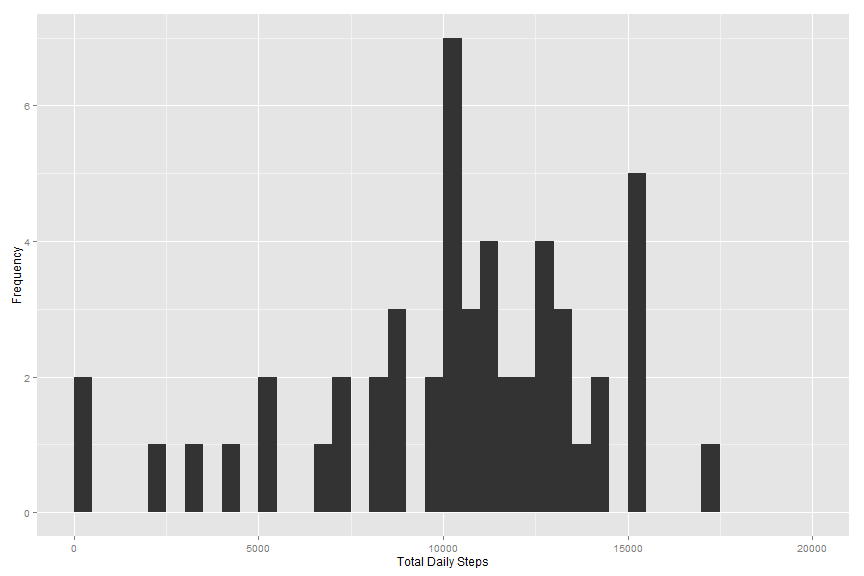
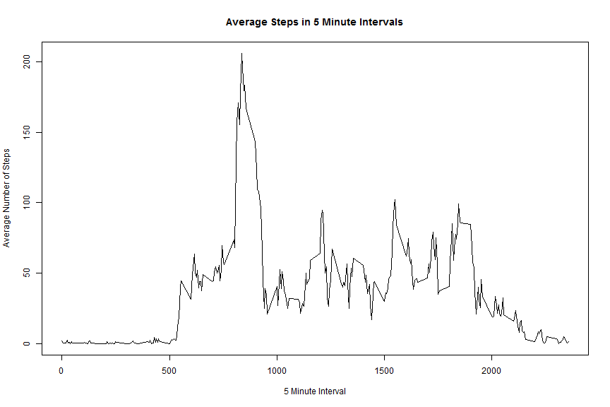
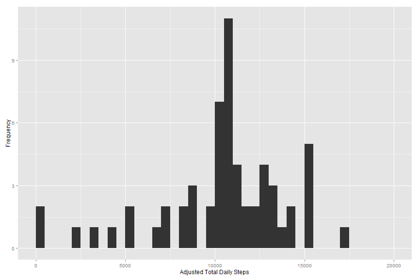
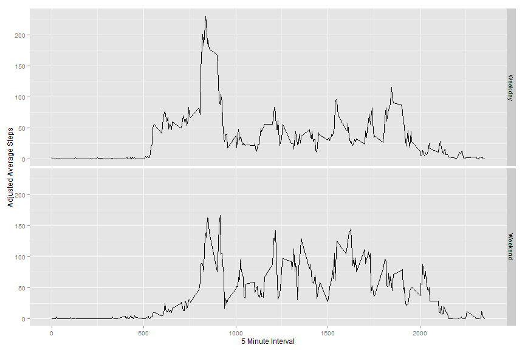

# Reproducible Research: Peer Assessment 1


## Data

The data for this assignment can be found within this GitHub repository.

  Dataset: Activity monitoring data
  File Name: activity.zip

The variables included in this dataset are:

 * steps: Number of steps taking in a 5-minute interval (missing values are coded as NA)
 * date: The date on which the measurement was taken in YYYY-MM-DD format
 * interval: Identifier for the 5-minute interval in which measurement was taken

The dataset is stored in a comma-separated-value (CSV) file and there are a total of 17,568 observations in this dataset.

## Loading and preprocessing the data

We'll begin by loading the data itself into R. This process assumes that the data has been extracted from its archive and placed into the data directory within our working directory.


```r
rawdata <- read.csv("./data/activity.csv", colClasses=c("numeric","factor","numeric"))
```

Let's also convert this raw data into a tbl for easier processing via the dplyr package.


```r
library(plyr); library(dplyr); library(ggplot2)
```

The tbl_df function will get us where we want to be.


```r
data <- tbl_df(rawdata)
```

We'll store a copy of the data grouped by day for easy summarization later.


```r
byday <- group_by(data, date)
```

We'll store a second copy of the data, this time grouped by interval, for the same purpose.


```r
byint <- group_by(data, interval)
```


## What is mean total number of steps taken per day?

We can use the summarize function to calculate the total number of steps on the byday tbl which is already grouped by day. This yields a dataframe of dates and the total steps recorded for each.


```r
totbyday <- summarize(byday,sum(steps))
names(totbyday) <- c("Date","Steps")
print(totbyday)
```

```
## Source: local data frame [61 x 2]
## 
##          Date Steps
## 1  2012-10-01    NA
## 2  2012-10-02   126
## 3  2012-10-03 11352
## 4  2012-10-04 12116
## 5  2012-10-05 13294
## 6  2012-10-06 15420
## 7  2012-10-07 11015
## 8  2012-10-08    NA
## 9  2012-10-09 12811
## 10 2012-10-10  9900
## ..        ...   ...
```

Next, let's look at the frequency distribution of the total number of steps taken in a histogram. We'll use ggplot2 for this.


```r
ggplot(data=totbyday, aes(totbyday$Steps)) +
    geom_histogram(breaks=seq(0,20000,by=500)) +
    labs(x="Total Daily Steps", y="Frequency")
```

 

Now that we have the totals calculated, we can also work out the mean and median of total steps per day. (Note that we're excluding NA values.)


```r
mean(totbyday$Steps, na.rm=TRUE)
```

```
## [1] 10766.19
```

```r
median(totbyday$Steps, na.rm=TRUE)
```

```
## [1] 10765
```

As the code above shows, if we round to avoid partial steps, then the *mean* is **10766 steps**, and the *median* is **10765 steps**.

## What is the average daily activity pattern?

Let's look at the daily averages now by 5 minute interval. I like to restore the leading zeroes to each interval, so that they are visually similar to a 24-hour time, but this has no impact on the calculations we'll be doing.


```r
meanbyint <- summarize(byint,mean(steps, na.rm=TRUE))
meanbyint$interval <- sprintf("%04d", meanbyint$interval)
names(meanbyint) <- c("Interval", "Steps")
```

We'll use the base plotting system to create a line graph which shows the average daily trend of total steps taken in the 5 minute intervals.


```r
plot(meanbyint, type="l",
     ylab="Average Number of Steps", 
     xlab="5 Minute Interval", 
     main="Average Steps in 5 Minute Intervals")
```

 

While it's easy to visually distinguish the peak stepping time on the graph, we can also extract it directly from the data we've set up. Let's get more concrete.


```r
meanbyint[which.max(meanbyint$Steps),]
```

```
## Source: local data frame [1 x 2]
## 
##   Interval    Steps
## 1     0835 206.1698
```

As the code above reveals, the 5 minute interval beginning at **0835** (AM) has the highest average number of steps across all days. During that interval, the recorded average rounded to the nearest whole number is **206** steps.

## Imputing missing values

We ignored the NA values earlier, but now we want to deal with them differently. Let's begin by finding out how many NA values are present in the data set.


```r
sum(is.na(data))
```

```
## [1] 2304
```

Ok, we have **2304** observations which contain NA values. Let's use a filling strategy which replaces each NA value with the mean of the interval across all days. The ddply function from the plyer package can help us with this process.


```r
fill.data <- ddply(data, .(interval), mutate, steps = ifelse(is.na(steps), 
                  round(mean(steps, na.rm = TRUE)), steps))
head(fill.data)
```

```
##   steps       date interval
## 1     2 2012-10-01        0
## 2     0 2012-10-02        0
## 3     0 2012-10-03        0
## 4    47 2012-10-04        0
## 5     0 2012-10-05        0
## 6     0 2012-10-06        0
```

Great, except that the ddply function changed the sorting of our data frame. Looks like we're now sorted by interval, then by date. We can fix that with a quick arrange command. We'll store the results for review and convert it into a tbl.


```r
adjusted.data <- arrange(fill.data, date, interval)
adjusted.data <- tbl_df(adjusted.data)
head(adjusted.data)
```

```
## Source: local data frame [6 x 3]
## 
##   steps       date interval
## 1     2 2012-10-01        0
## 2     0 2012-10-01        5
## 3     0 2012-10-01       10
## 4     0 2012-10-01       15
## 5     0 2012-10-01       20
## 6     2 2012-10-01       25
```

Awesome. Looks like we successfully executed our strategy, and now the data is back in the shape we originally saw. Let's confirm by running a few checks. We'll compare NA counts, dimensions, and structures.


```r
sum(is.na(data))
```

```
## [1] 2304
```

```r
sum(is.na(adjusted.data))
```

```
## [1] 0
```

```r
dim(adjusted.data)==dim(data)
```

```
## [1] TRUE TRUE
```

```r
str(data)
```

```
## Classes 'tbl_df', 'tbl' and 'data.frame':	17568 obs. of  3 variables:
##  $ steps   : num  NA NA NA NA NA NA NA NA NA NA ...
##  $ date    : Factor w/ 61 levels "2012-10-01","2012-10-02",..: 1 1 1 1 1 1 1 1 1 1 ...
##  $ interval: num  0 5 10 15 20 25 30 35 40 45 ...
```

```r
str(adjusted.data)
```

```
## Classes 'tbl_df', 'tbl' and 'data.frame':	17568 obs. of  3 variables:
##  $ steps   : num  2 0 0 0 0 2 1 1 0 1 ...
##  $ date    : Factor w/ 61 levels "2012-10-01","2012-10-02",..: 1 1 1 1 1 1 1 1 1 1 ...
##  $ interval: num  0 5 10 15 20 25 30 35 40 45 ...
```

Everything checks out! Let's see what effect our filling strategy has on our analysis.


```r
adjbyday <- group_by(adjusted.data, date)
adjbyint <- group_by(adjusted.data, interval)
adjtotbyday <- summarize(adjbyday,sum(steps))
names(adjtotbyday) <- c("Date","Steps")
print(adjtotbyday)
```

```
## Source: local data frame [61 x 2]
## 
##          Date Steps
## 1  2012-10-01 10762
## 2  2012-10-02   126
## 3  2012-10-03 11352
## 4  2012-10-04 12116
## 5  2012-10-05 13294
## 6  2012-10-06 15420
## 7  2012-10-07 11015
## 8  2012-10-08 10762
## 9  2012-10-09 12811
## 10 2012-10-10  9900
## ..        ...   ...
```

For comparison with the histogram above, let's take another look at the frequency distribution of the total number of steps taken.


```r
ggplot(data=adjtotbyday, aes(adjtotbyday$Steps)) +
    geom_histogram(breaks=seq(0,20000,by=500)) +
    labs(x="Adjusted Total Daily Steps", y="Frequency")
```

 

Now that we have the totals calculated, we can also work out the mean and median of total steps per day. (Note that we no longer need to exclude NA values, since we replaced them in the dataset already.)


```r
mean(adjtotbyday$Steps)
```

```
## [1] 10765.64
```

```r
median(adjtotbyday$Steps)
```

```
## [1] 10762
```

As the code above shows, if we round to avoid partial steps, then the *mean* is **10766 steps**, and the *median* is **10762 steps**. 

For comparison, you'll recall that our analysis of the raw data, where we dropped NA values and again rounded to avoid partial steps, showed a *mean* of **10766 steps** and a *median* of **10765 steps**.

We can see that our adjusted mean differs from the original mean by **0 steps** while the adjusted median differs from the original median by **-3 steps**.

## Are there differences in activity patterns between weekdays and weekends?

To find out whether any differences exist, we need to first create a new factor variable in the adjusted dataset. Let's convert the date column in our adjusted.data dataframe from a factor to a date so we can use the weekdays function against it.


```r
adjusted.data$date <- as.Date(adjusted.data$date)
```

Now we can add that factor into the existing tbl which contains our adjusted data.


```r
adjusted.data$daytype <- as.factor(ifelse(
        grepl("Sat|Sun",weekdays(adjusted.data$date, abbreviate=TRUE)), 
              "Weekend","Weekday"))
table(adjusted.data$daytype)
```

```
## 
## Weekday Weekend 
##   12960    4608
```

We need to regroup the data to account for our new factor variable.


```r
adjbyint <- group_by(adjusted.data, interval, daytype)
weekdayvsweekend <- summarize(adjbyint, mean(steps))
names(weekdayvsweekend) <- c("Interval", "DayType", "Steps")
```

Now we can produce a panel plot to see the difference between weekdays and weekend days.


```r
ggplot(data=weekdayvsweekend, aes(x = Interval, y = Steps)) + 
  geom_line() + 
  facet_grid(DayType ~ .) +
  labs(x="5 Minute Interval", y="Adjusted Average Steps")
```

 

Seems like on average, the subjects who provided this data walk more in the morning hours on both weekends and weekdays, but during the weekend, they walk more during other daytime hours than they do during the week.
